<!--
  This is your PROFILE README. It goes in a repo named exactly after your
  username (e.g. github.com/IshaanYK/IshaanYK) so GitHub shows it on your profile.
  Widths 370/490 keep the portrait and info card the same height.
-->

# ⚡ Welcome to my Profile!

<!-- Profile views counter -->

 

<table>
<tr>
<td valign="top"></td>
<td valign="top"></td>
</tr>
</table>

## ISHAAN
**AI Engineer · Developer**

 

<!-- Custom themed GitHub Stats & Top Languages -->
<table>
<tr>
<td valign="top"></td>
<td valign="top"></td>
</tr>
</table>

 

<!-- animated contribution graph, refreshed daily by the workflow -->

