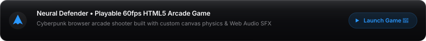
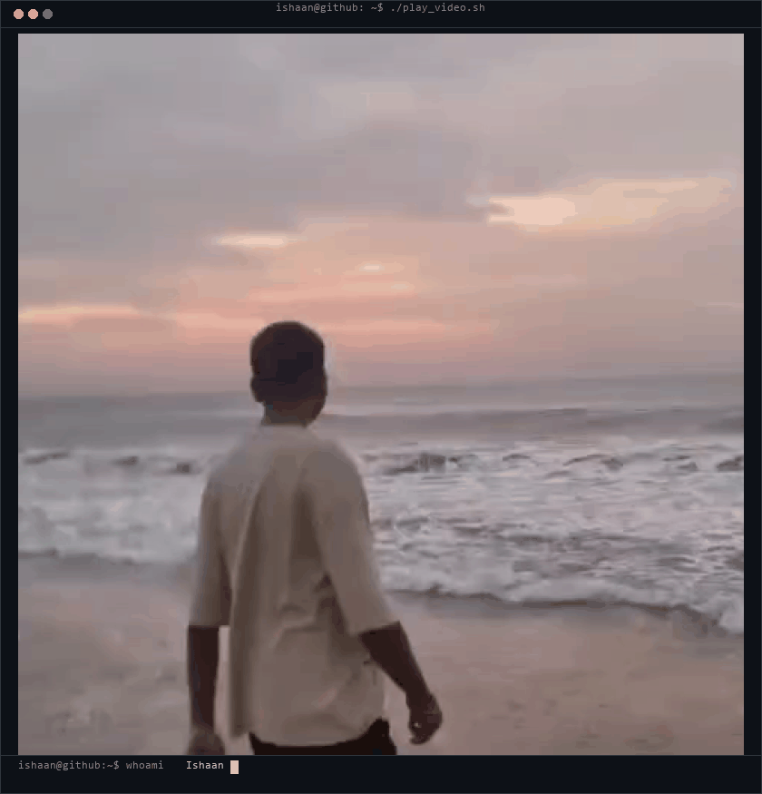

<!-- ⚡ Master Executive Holographic Header -->

<!-- Quick Action Pills -->

  
  
  
  
  

<!-- 🧠 Autonomous AI Agent Supervisor & Quantum Telemetry Terminal -->

<!-- ⚡ 4-Pillar Neural Ecosystem Architecture -->

<!-- 🕹️ Interactive 60fps Arcade Shooter Game -->

<!-- 🎧 Interactive Ambient Audio Streamer -->

<!-- 🍱 Portrait & Neofetch Terminal Bento -->
<table border="0" cellspacing="0" cellpadding="6" width="100%">
<tr>
<td align="center" width="40%" style="border:none;">
  
</td>
<td align="center" width="60%" style="border:none;">
  
</td>
</tr>
</table>

---

### 👨‍💻 Executive Summary & Technical Vision

> **AI Systems Architect & Full-Stack Engineer** at **Indian Institute of Technology Madras (IIT Madras)**. Specializing in **autonomous multi-agent orchestration**, **real-time voice AI architectures**, and **scalable sub-second latency web applications**. Passionate about bridging theoretical machine learning breakthroughs into resilient, production-grade distributed systems.

* 🎓 **Education**: Indian Institute of Technology Madras (IIT Madras)
* 💼 **Current Status**: **Actively Open to Full-Time Roles, Internships & High-Impact Research Collaborations**
* 🧠 **Primary Focus**: Autonomous Agent Loops • Real-Time Voice Pipelines • Production RAG • Next.js 15 & FastAPI Distributed Systems
* 📬 **Get in Touch**: [ishaansenres@gmail.com](mailto:ishaansenres@gmail.com) • [LinkedIn (@ishaan784)](https://www.linkedin.com/in/ishaan784/)

---

### 🛠️ Technical Competency Matrix

| 🧠 AI, ML & Autonomous Agents | ⚡ Full-Stack & Frontend Engineering |
| :--- | :--- |
| **Frameworks:** PyTorch, LangChain, CrewAI, LlamaIndex, Hugging Face | **Core:** TypeScript, JavaScript (ES6+), Python, C++ |
| **Architectures:** Multi-Agent Workflows, Production RAG, Tool Loops | **Frontend:** Next.js 15 (App Router), React 19, Tailwind CSS v4, Redux |
| **Voice AI:** Real-time Whisper STT, TTS Models, WebRTC / WebSockets | **Graphics & UI:** HTML5 Canvas, WebGL / Three.js, CSS Glassmorphism |
| **Models:** OpenAI, Anthropic, Gemini, Open LLMs (Llama 3, Mistral) | **Performance:** 60fps Optimization, Sub-second TTFB, Responsive UI |

| ⚙️ Backend, Systems & Databases | 🚀 DevOps, Cloud & Infrastructure |
| :--- | :--- |
| **Backend:** FastAPI, Node.js, Express, Python AsyncIO, REST & GraphQL | **Containers:** Docker, Docker Compose, Multi-stage Builds |
| **Databases:** PostgreSQL, Redis (Caching & Queues), SQLite, Prisma | **CI/CD:** GitHub Actions, Automated Testing Pipelines |
| **Vector Stores:** Pinecone, ChromaDB, pgvector | **Cloud:** AWS (S3, EC2, Lambda), GCP (Cloud Run), Vercel |
| **Networking:** WebSockets, SSE, WebRTC, High-Throughput I/O | **Environment:** Linux, Git, PowerShell, Nginx |

---

### 📂 Featured Production Projects

#### 📞 [call-agent](https://github.com/IshaanYK/call-agent) — Real-Time Autonomous Voice AI
* **Overview:** An autonomous AI-powered agent configured to receive, parse, and converse via live voice calls with sub-second STT/TTS latency.
* **Architecture:** Bi-directional audio streaming over WebSockets, autonomous tool-calling loop, and dynamic context parsing.
* **Stack:** `JavaScript` `Node.js` `Voice AI` `Speech API` `WebSockets`
* 🔗 **[Explore GitHub Repository →](https://github.com/IshaanYK/call-agent)**

#### 💾 [STORAGE-WIDGET](https://github.com/IshaanYK/STORAGE-WIDGET) — High-Performance System Telemetry Daemon
* **Overview:** A lightweight disk quota and system telemetry daemon for monitoring real-time I/O metrics, storage allocations, and background alerts.
* **Architecture:** Zero-overhead background thread, automated threshold notifications, and OS-level metric aggregation.
* **Stack:** `Python` `System Daemon` `Telemetry` `Performance Profiling`
* 🔗 **[Explore GitHub Repository →](https://github.com/IshaanYK/STORAGE-WIDGET)**

#### 🎮 [NEURAL DEFENDER](https://github.com/IshaanYK/IshaanYK/tree/main/game) — 60fps HTML5 Canvas Arcade Game
* **Overview:** A fast-paced cyberpunk browser arcade shooter built with custom 2D particle physics, spatial collision detection, and Web Audio synth SFX.
* **Architecture:** Locked 60fps frame budget, real-time audio synthesizer, and zero external framework dependencies.
* **Stack:** `HTML5 Canvas` `JavaScript` `Web Audio API`
* 🚀 **[Play Live in Browser →](https://ishaanyk.github.io/IshaanYK/game/)** • 🔗 **[View Source Code →](https://github.com/IshaanYK/IshaanYK/tree/main/game)**

#### 🌐 [portfolio-me](https://github.com/IshaanYK/portfolio-me) — Production Showcase & Interactive Portfolio
* **Overview:** A responsive personal engineering website engineered for speed, clean UX accessibility, and interactive design token aesthetics.
* **Architecture:** 95+ Lighthouse score, responsive glassmorphic design system, and fast global CDN deployment.
* **Stack:** `HTML5` `CSS3` `JavaScript` `Vercel`
* ✨ **[Visit Live Website →](https://ishaanyk.github.io/portfolio-me/)** • 🔗 **[Explore GitHub Repository →](https://github.com/IshaanYK/portfolio-me)**

---

### 📊 Live Synchronized Contribution Matrix (189+ Verified Contributions)

  

---

<b>✨ Click to reveal System Architecture &amp; Vision Lore 💡</b>

 

> *"Simplicity is prerequisite for reliability. The best way to predict the future is to build it autonomously."*

* 🎓 **Academic Academy**: Student at **Indian Institute of Technology Madras (IIT Madras)**.
* 🤖 **Main Quest**: Designing autonomous multi-agent pipelines, real-time voice AI, and self-improving neural frameworks.
* ⚡ **Combat Gear**: Python, Next.js 15, PyTorch, TypeScript, Docker, and ultra-responsive 60fps+ UIs.
 

---

### 📬 Contact & Connect

I am actively open to discussing **Software Engineering, AI/ML Engineering, and Full-Stack opportunities**.

  
  
  

